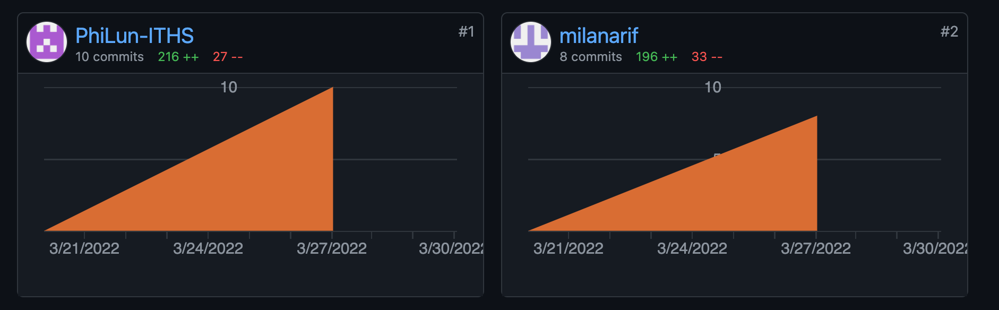

# STUDENT MANAGEMENT SYSTEM

## Entities
### Student
- Long id : Unique id for each student
- String firstName : Student's First name
- String lastName : Student's Last name
- String email : Student's email (**unique**)
- String phoneNumber : Student's phone number **optional**

### Teacher
- Long id: Unique id for each teacher
- String firstName: Teacher's first name
- String lastName: Teacher's last name

### Subject
- Long id: Unique id for each subject
- String name: Subject's name
- List students: List of students enrolled in subject
- Teacher teacher: Teacher teaching the subject

## Custom Exception
DuplicateEmailException is a custom exception when duplicate emails are detected.

---
# Endpoints

## Root URL
`http://localhost:8080/student-management-system/api/v1/`


## Students
`http://localhost:8080/student-management-system/api/v1/students`
### GET: Returns all students

### POST: Add new student, (see example below).

```
{
    "firstName": "Gunnar",
    "lastName": "Gunnarsson",
    "email": "Gunnar@gunnar.se",
    "phoneNumber": "07077077070707"
}
```

### PUT: Update student if existing, else create new (requires ID).
```
{
    "id": 1,
    "firstName": "Gunnar",
    "lastName": "Gunnarsson",
    "email": "Gunnar@gunnar.se",
    "phoneNumber": "07077077070707"
}
```

---

`http://localhost:8080/student-management-system/api/v1/students/{id}`

### GET: Returns student with that id.

### DELETE: Deletes student with that id.

### PATCH: Patches student with that id (requires body).

---

### GET: Returns student(s) with matching last name.

`http://localhost:8080/student-management-system/api/v1/students/query?lastName={lastName}`

---


## Teachers

`http://localhost:8080/student-management-system/api/v1/teachers`

### GET: Returns all teachers

### POST: Add new teacher, (see example below).

```
{
    "firstName": "Gunnar",
    "lastName": "Gunnarsson"
}
```

---
`http://localhost:8080/student-management-system/api/v1/teachers/{id}`
### DELETE: Delete teacher
---

## Subjects
`http://localhost:8080/student-management-system/api/v1/subjects`


## WORKLOG
Vi har arbetat med det mesta båda två, suttit tillsammans i teams och både parprogrammerat och arbetat individuellt. Båda har varit med på det mesta. Milan jobbade mer med PUT och Philip mer med PATCH. Vi har gjort allt tillsammans och saker har bytt händer mellan commits, vi delade aldrig upp arbetet riktigt utan tog saker i den ordning de dök upp.


